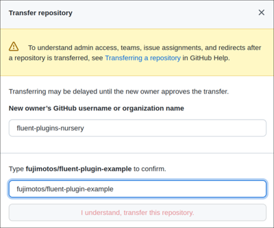

# Fluent Plugins Nursery

Welcome to [Fluent Plugins Nursery](https://github.com/fluent-plugins-nursery).
This is a community organization with the goal to maintain and improve Fluentd plugins.

> Our _raison d'être_ is to keep Fluentd ecosystem healthy by adapting orphaned/stalled Fluentd plugins.

This organization is administrated by [Fluentd core maintainers](https://github.com/fluent/fluentd/blob/master/MAINTAINERS.md).

## What happens if I transfer my plugin?

**Once you transferred your plugin:**

* Your plugin gets additional support by Fluentd maintainers.
* Your plugin will be hosted under this organization e.g. `fluent-plugins-nursery/fluent-plugin-xyz`.

**We respect your authorship:**

* You retain the privilege to push to the Git repository and publish new Gems.
* You retain the full copyright on your work/contribution.

## How to transfer your plugin

### Process Checklist

Mark all the following checkboxes to complete the transfer process:

1. [ ] Original author agrees to transfer their project (Create [a new issue](https://github.com/fluent-plugins-nursery/contact/issues/new) to initiate the process)
2. [ ] Admins invite the original author to `fluent-plugin-nursery`.
3. [ ] Original author transfers repository to `fluent-plugins-nursery`. ([How to transfer your repository](/README.md#how-to-transfer-your-repository))
4. [ ] Original author adds a new maintainer as a Gem owner. ([How to add a new maintainer to your Gem](/README.md#how-to-add-a-new-maintainer-to-your-gem))
5. [ ] Close ticket. Done!

### How to transfer your repository

Go to your repository and select "Settings > General".


Click "Transfer ownership" and confirm the dialog.



### How to add a new maintainer to your Gem

Run `gem owner` commands like this:

```
$ gem owner GEM --add fujimoto@ceptord.net
```

## FAQ

* Q: Why transfer ownership?
* A: Because it is easy for Fluentd users to find the repository that is maintainable and sustainable.
     And Fluentd development core team encourages to contribute plugin upstream repository, we don't want to fork original authors'.
     See [Fluentd development core team's opinion](https://docs.fluentd.org/plugin-development#send-a-patch-or-fork)
* Q: Original authors are missing!
* A: You can find out them on the internet. If you cannot find out them, we can help you.
* Q: I'm a plugin developer. I want to support Fluentd's new features. But I don't know what should I do.
* A: Let's go [Fluentd community](https://www.fluentd.org/community)!
* Q: I want to talk to you before create issue.
* A: Please contact us on https://github.com/fluent/fluentd/discussions
* Q: Is there any option than transferring ownership?
* A: See https://github.com/fluent-plugins-nursery/contact/blob/master/related-projects.md

## Admins (Alphabetical order)

* [@ashie](https://github.com/ashie)
* [@cosmo0920](https://github.com/cosmo0920)
* [@daipom](https://github.com/daipom)
* [@fujimotos](https://github.com/fujimotos)
* [@kenhys](https://github.com/kenhys)
* [@okkez](https://github.com/okkez)
